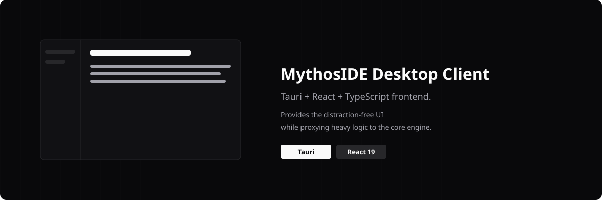

<div align="center">
  
</div>

# MythosIDE Desktop (`mythoside-ts`)

[](./LICENSE.md)

<p align="center"><a href="./README.md">English</a> · Türkçe</p>

<p align="center">
  <a href="https://github.com/Mythos-IDE">Ekosistem</a>
  &nbsp;·&nbsp;
  <a href="https://github.com/Mythos-IDE/mythoside-core">Çekirdek motor</a>
  &nbsp;·&nbsp;
  <a href="https://github.com/Mythos-IDE/mythoside-website">Web sitesi</a>
</p>

**MythosIDE**'nin masaüstü istemcisi — romancıların fiilen yazdığı, editör benzeri sakin yüzey. [`mythoside-core`](https://github.com/Mythos-IDE/mythoside-core) Rust motorunu yönetilen bir **sidecar** olarak barındıran ve ona proxy yapan bir Tauri + React + TypeScript uygulamasıdır; böylece ağır iş (ayrıştırma, dosya izleme, ilişkiler) motorda kalır ve bu repo arayüze odaklı kalır.

> **Durum:** erken geliştirme aşaması. Arayüz yeniden inşa ediliyor; eksikler olabilir.

## Nasıl birleşiyor

```text
mythoside-ts (bu repo)            mythoside-core (sidecar)
┌───────────────────────┐  stdio  ┌────────────────────────┐
│  React 19 UI + editör │ ◂─────▸ │  Rust motoru, port yok  │
│  Tauri kabuğu         │  JSON   │  Diskte Markdown + YAML │
└───────────────────────┘  -RPC   └────────────────────────┘
```

Motor asla bir ağ portu açmaz — uygulama onunla standart girdi/çıktı üzerinden konuşur, yani dünyan özel bir yerel process olarak kalır.

## Teknoloji Yığını

| Katman | Araçlar |
| --- | --- |
| Kabuk | Tauri 2 |
| Arayüz | React 19, TypeScript, Tailwind CSS v4 |
| Build | Vite |
| Veri | Yönetilen bir sidecar üzerinden yerel `mythoside-core` binary'sine proxy |

## Yerelde Çalıştırma

Node.js, npm, Rust ve platformunuza uygun [Tauri ön koşulları](https://tauri.app/start/prerequisites/) gerekir.

```bash
git clone https://github.com/Mythos-IDE/mythoside-ts.git
cd mythoside-ts
npm install
npm run tauri dev
```

## Proje Yapısı

```text
src/         React arayüzü — bileşenler, hook'lar, editör yüzeyi
src-tauri/   Tauri kurulumu, sidecar yönetimi ve Rust ↔ TS köprüsü
```

## Lisans

[Functional Source License, v1.1 (ALv2 Future License)](./LICENSE.md) kapsamında kaynak kodu erişilebilir — kendi yazma süreçleriniz için kullanabilir, inceleyebilir, değiştirebilir ve kendi sunucunuzda barındırabilirsiniz; sadece rakip bir ürün olarak yeniden paketleyemezsiniz. Her sürüm, yayınlandıktan iki yıl sonra otomatik olarak Apache 2.0'a dönüşür.

## Katkı ve Güvenlik

[CONTRIBUTING.md](https://github.com/Mythos-IDE/.github/blob/main/CONTRIBUTING.md) ve [SECURITY.md](https://github.com/Mythos-IDE/.github/blob/main/SECURITY.md) belgelerine bakın.
